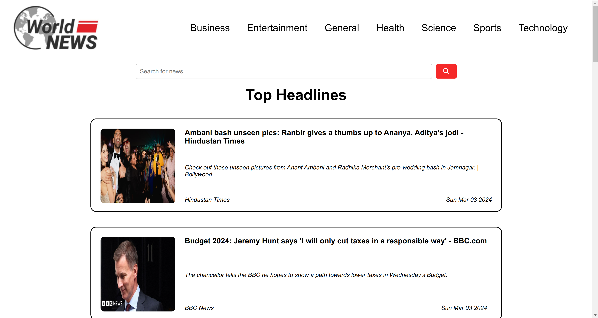
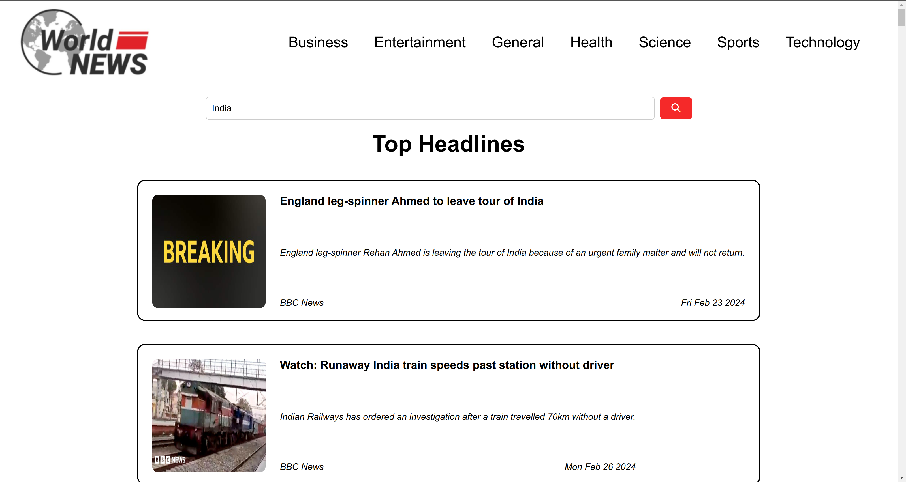

# World News (NBNW ASSIGNMENT)
This React project integrates an external API to fetch and display real-time news headlines on a sample news website.

#### Features
- Fetches news headlines from an external API.
- Displays headlines in a user-friendly format.
- Cache the responses to reduce the number of API calls.
- Implement error handling for cases where the API request fails.


## Getting Started

1. Cloning the Repository:
```
git clone https://github.com/aamit2267/World-News.git
```

2. Install dependencies:
```
cd World-News/
npm install
```

3. Run the development server:
(Make sure to set [API KEY](#api-configuration) first)
```
npm start
```

This will start the development server and open the application in your default browser at http://localhost:3000.

## API Configuration

1. Visit: https://newsapi.org/ and SignIn/SignUp

2. Click `Get API`

3. Copy Generated API KEY

4. In [src/utils/api.js](src/utils/api.js):

```
const api = "YOUR_API_KEY_HERE";
```
Set your api key as string and you are all set.

## Glimpse



## Disclaimer
This project is intended for educational purposes only and is not intended for production use.

## Author
This project was created by [Amit Agarwal](https://github.com/aamit2267).